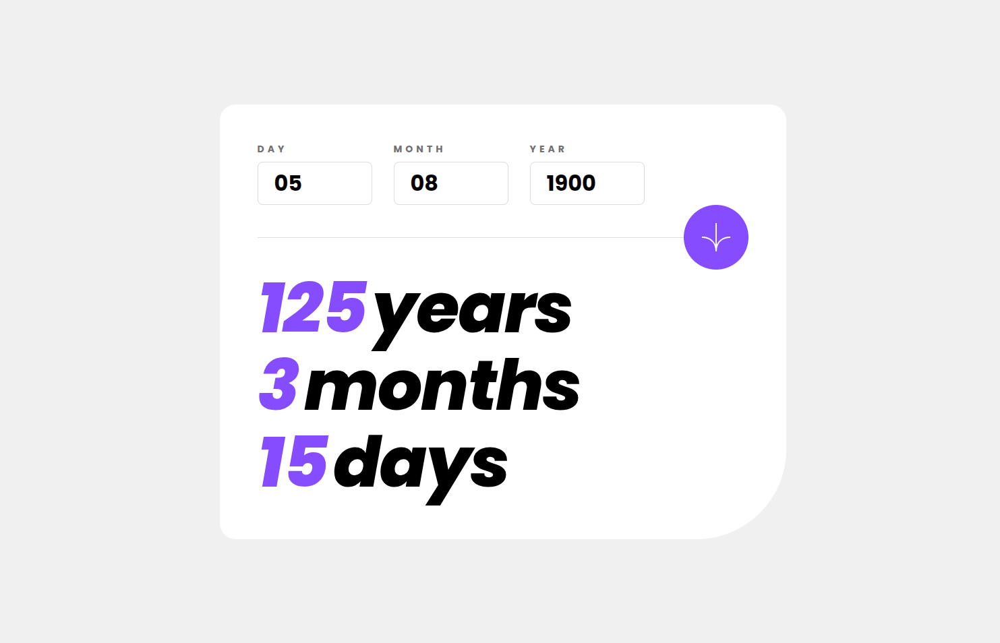

# Frontend Mentor - Age calculator app solution

This is a solution to the [Age calculator app challenge on Frontend Mentor](https://www.frontendmentor.io/challenges/age-calculator-app-dF9DFFpj-Q).

## Table of contents

- [Overview](#overview)
  - [The challenge](#the-challenge)
  - [Screenshot](#screenshot)
  - [Links](#links)
- [My process](#my-process)
  - [Built with](#built-with)
  - [What I learned](#what-i-learned)

## Overview

### The challenge

Users should be able to:

- View an age in years, months, and days after submitting a valid date through the form
- Receive validation errors if:
  - Any field is empty when the form is submitted
  - The day number is not between 1-31
  - The month number is not between 1-12
  - The year is in the future
  - The date is invalid e.g. 31/04/1991 (there are 30 days in April)
- View the optimal layout for the interface depending on their device's screen size
- See hover and focus states for all interactive elements on the page
- **Bonus**: See the age numbers animate to their final number when the form is submitted

### Screenshot



### Links

- [Solution](https://github.com/kxrn0/age_calculator_app/)
- [Live](https://kxrn0.github.io/age_calculator_app/)

## My process

### Built with

[Vue](https://vuejs.org)
[Sass](https://sass-lang.com)

### What I learned

#### vue

I learned the basics of Vue and then some more. I used [the official guide](https://vuejs.org/guide/) to understand the basics.

I used a composable for the state of the input elements because the parent needs to use it, and it doesn't quite belong to the input component itself. I made it so that the state changes from the input by emiting an event to the parent, as I've heard that's a best practice in vue.

#### scss

I also learned to use mixins in scss. In the design file the designer created some text presets like `text-preset-1` and `text-preset-2`, which I initially translated to css, like

```css
.text-preset-1 {
  font-size: 2rem;
}

.text-preset-2 {
  font-size: 1rem;
}
```

and I was planning on using them as utility classes, however I later noticed that the designer gave a text preset to an element on desktop, and a different one on mobile. I thought about doing something like

```css
.text-preset-1 {
  font-size: 2rem;

  @media (max-width: 500px) {
    font-size: 1rem;
  }
}
```

so I'd be duplicating the css for a text preset in another one. I was already using scss, but only for nesting, and I rembered mixins. I knew about them, but had never used them. I learned that I can import them in the `style` tag and `include` them in classes. That way I can keep classes semantic (which isn't totally necessary because vue scopes css).
